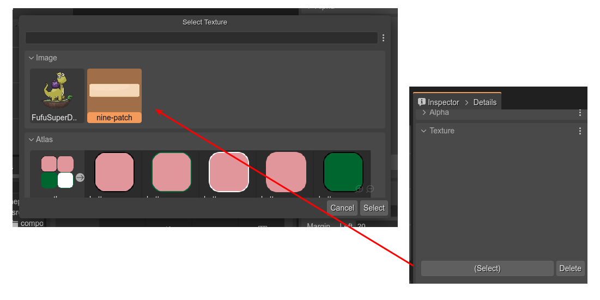

# Phaser Editor 2D v3 - NinePatch plugin

This repository contains NinePatch plugin for Phaser Editor 2D v3.

## Install

The plugin is distributed as a NodeJS package:

```bash
$ npm i --save-dev phasereditor2d-ninepatch-plugin
```

It is important that you install the package as a development dependency (`--save-dev`), because Phaser Editor 2D only searches for plugins in that section. Also, the `package.json` file should be in the root of the project.

## Creating a NinePatch object

For creating a NinePatch object, you can drag the **NinePatch** type from the **Built-In** section of the **Blocks** view and drop it in the scene.

Because the default NinePatch object doesn't have a texture, it shows a blank image:


You can set a texture to the object in the **Texture** section:




Another way of creating a NinePatch object is converting an **Image** object into a **NinePatch** object.


## NinePatch parameters  

The NinePatch objects are rendering by taking frames of the original texture. These frames are created using margins. You can change the margin values in the **NinePatch** section of the **Inspector** view.

This section also includes the parameters for changing the size and disabling the rendering of the object's center:


There are other properties common to the Image object, like those in the sections Transform, Origin, Visible, Texture, etc...

## Size manipulators

You can resize the NinePatch object with the **Size Tool**. Press the `Z` key or select this tool in the context menu **Tools** > **Resize Tool**.


## Code generation

The NinePatch object is not available in the Phaser built-in API. Phaser Editor 2D uses an internal implementation of this object, and provides the source code of a NinePatch game object that you can use in your project.

To get the source code of the NinePatch game object, execute the command **Create Nine Patch User Files**:


You can open the Command Palette in the main menu or by pressing the `Ctrl+K` keys.

Look you there are four different commands:

* For creating JavaScript files as ES modules.
* For creating simple JavaScript files.
* For creating TypeScript files as ES modules.
* For creating simple TypeScript files.

These commands create a series of files with the source code of the NinePatch object. The files are copied in the folder selected in the **Files** view.


The files are following:

### `NinePatch.ts`
 
Contains the implementation of the NinePatch game object.

You can create a new instance like this:

```javascript
const obj = new NinePatch(scene, 10, 10, 100, 100, "atlas", "green-button");
scene.add.existing(obj);
```

In addition to the `NinePatch.ts` file, the `NinePatchImage.ts` & `NinePatchContainer.ts` files are generated, with a similar format.

### `registerNinePatchFactory.ts`

Contains the `registerNinePatchFactory()` function. 

You should use it for registering a `GameObjectFactory` method. It allows you creating new NinePatch objects like this: 

```javascript
const obj = this.add.ninePatch(10, 10, 100, 100, "nine-patch-texture");
```
Before, you need to register the factory:

```javascript

const game = new Phaser.Game(...);
...
registerNinePatchFactory();
...
```

In addition to the `registerNinePatchFactory.ts` file, the `registerNinePatchImageFactory.ts` & `registerNinePatchContainerFactory.ts` files are generated, with a similar format.

### `ninepatch.d.ts`

Contains the TypeScript definitions. Maybe you should move it to the `types` folder of your project. Or you should configure the `tsconfig.json` file finding the definitions.

## Same interface, different implementations

The **NinePatch** class extends the `Phaser.GameObjects.RenderTexture` class. A `RenderTexture` may consume a lot of memory and could affect the performance of your game. But you can use one of the following alternatives:

### NinePatchImage

The **NinePatchImage** class extends the `Phaser.GameObjects.Image` class. The idea is to draw the nine-patch in a texture and set this texture to the image object. It saves the generated texture in the textures cache, so if different objects share the same nine-patch properties (like margins), they will use the same texture from the cache.

Generating a new texture for an **NinePatchImage** object is expensive, but if you have a lot of nine-patch objects with the same properties, the dynamically generated texture is cached and generated once. This may boost the performance of your game and could be a much better alternative to the **NinePatch** class.

If you use the **NinePatchImage** class in your game, you should register its factory like this:

```javascript

const game = new Phaser.Game(...);
...
registerNinePatchImageFactory();
...
```

### NinePatchContainer

The **NinePatchContainer** class extends the `Phaser.GameObjects.Container` class. The idea is to group the nine patches inside a container. This implementation has the advantage of a low memory consumption and a fast rendering. Each patch is an image with a frame of the main texture.

I recommend this implementation if:

* The ninepatch object's properties are changing a lot in your game.
* The ninepatch objects have a huge size.
* Basically, don't use this implementation if generating & caching textures is too expensive in terms of memory & processing.

If you use the **NinePatchContainer** class in your game, you should register its factory like this:

```javascript

const game = new Phaser.Game(...);
...
registerNinePatchContainerFactory();
...
```

### Code customization

You are free to change the code of the generated NinePatch files, however, take in consideration that the scene's code generated by the editor uses always the same public interface of the NinePatch object.

## What's next

We should work on other NinePatch properties like the Axis Stretch (Stretch, Tile, Tile Fit). Yes, it is inspired by the Godot's NinePatch object.